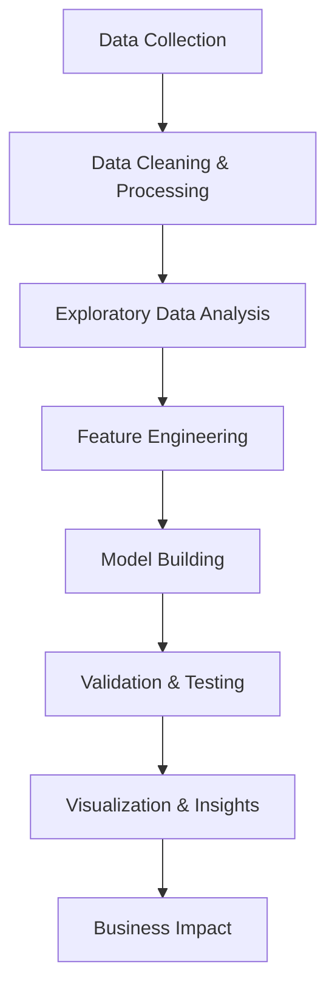

# Hi there, I'm Al Amin Sheikh! 👋

<div align="center">
  
[](https://www.linkedin.com/in/alaminsframe/)
[](mailto:alaminsheikh12180@gmail.com)
[](tel:+8801575137573)
[]()

</div>

## 🚀 About Me

I'm a **passionate developer** and **aspiring data scientist** with a unique blend of creative web development skills and analytical mathematical foundation. Currently pursuing my BSc in Mathematics at Dhaka College while actively transitioning from front-end development to the exciting world of data science.

```python
class AlAminSheikh:
    def __init__(self):
        self.role = "Junior Developer → Data Science Aspirant"
        self.location = "Jatrabari, Dhaka 🇧🇩"
        self.education = "BSc Mathematics (2022-2026)"
        self.current_focus = "Data Analytics & Machine Learning"
        self.passion = "Solving complex problems with data-driven insights"
    
    def get_current_goals(self):
        return [
            "🎯 Master Python for Data Science",
            "📊 Build impressive data visualization projects",
            "🤖 Dive deep into Machine Learning algorithms",
            "🏆 Land my first Data Science role"
        ]
```

## 💼 Professional Journey

### 🌱 Currently Learning
- **Data Science Pipeline**: From data collection to model deployment
- **Advanced Python**: Pandas, NumPy, SciPy for data manipulation
- **Machine Learning**: Supervised & Unsupervised learning algorithms
- **Data Visualization**: Creating compelling stories with Tableau, Matplotlib

### 🔧 Recent Experience
**Junior Developer (Intern)** | *Jul 2023 - Nov 2023*
- Crafted responsive, pixel-perfect websites from design mockups
- Specialized in Figma/PSD to HTML/CSS conversion
- Developed WordPress sites using Elementor Pro
- Focused on user experience and mobile-first design

## 🛠️ Tech Stack & Tools

<div align="center">

### Programming & Analysis


### Databases


### Data Visualization


### Tools & Platforms


</div>

## 🎓 Education & Achievements

### 📚 Academic Background
**BSc in Mathematics** | *Dhaka College (2022-2026)*
- **Core Strengths**: Probability, Linear Algebra, Numerical Methods, Optimization
- **Analytical Foundation**: Abstract Algebra, Real Analysis
- **Practical Application**: Strong mathematical foundation for data analysis and algorithmic thinking

### 🏅 Leadership & Recognition
**Harvard Business School - Aspire Leaders Program** | *April 2024*
- Selected for highly competitive international leadership program
- Developed advanced skills in critical thinking and global collaboration
- Enhanced leadership capabilities through diverse, multicultural cohort

## 📊 What I'm Working On



## 🎯 2024 Goals

- [ ] Complete advanced DataCamp tracks in Machine Learning
- [ ] Build 5 end-to-end data science projects
- [ ] Contribute to open-source data science libraries
- [ ] Network with data science professionals
- [ ] Land my first Data Analyst/Junior Data Scientist role

## 📈 GitHub Stats

<div align="center">
  
[](https://github.com/alaminsframe)

[](https://github.com/alaminsframe)

</div>

## 🤝 Let's Connect!

I'm always excited to connect with fellow developers, data enthusiasts, and potential collaborators! Whether you're interested in:

- 💬 Discussing data science trends and opportunities
- 🚀 Collaborating on interesting projects
- 📚 Sharing learning resources and experiences
- 🎯 Exploring career opportunities in data science

**Feel free to reach out!** I'm open to conversations, mentorship, and collaboration opportunities.

---

<div align="center">

*"Turning data into insights, one algorithm at a time"* 📊✨

[](https://github.com/alaminsframe)

</div>
<br/>

<picture>
  <source media="(prefers-color-scheme: dark)" srcset="https://raw.githubusercontent.com/alaminsframe/alaminsframe/output/github-snake-dark.svg" />
  <source media="(prefers-color-scheme: light)" srcset="https://raw.githubusercontent.com/alaminsframe/alaminsframe/output/github-snake.svg" />
  
</picture>
